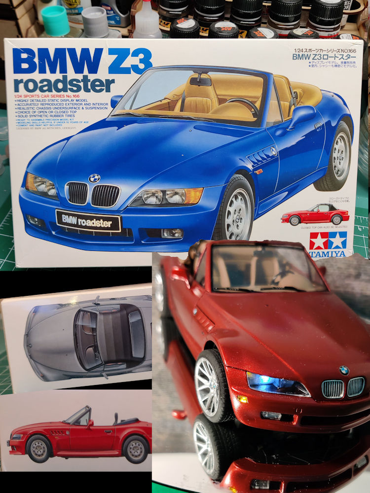
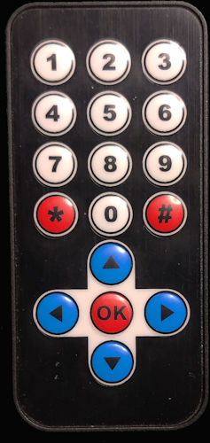

# BMW Z2 by Tamiya



Here are the support files for my build of the BMW Z3 by Tamiya.
LED lighting and an IR Remote have been added to bring this model to life. 
 
[See My YouTube Channel for more information](https://www.youtube.com/channel/UCbk7sF8TZ_Zz9eOcTYccMCg)


## Notes

This build uses two AVR controllers (ATTiny85 development board). 
1) ATtiny85 - Front controller. This one controls lighting effects for the front part of the car, responds to IR commands and is mounted under the hood
2) ATtiny85 - Rear controller. TThis one controls lighting effects for the rear part of the car, responds to IR commands and is mounted in the truck area

The same sketch file is used to program both controllers. Comment or uncomment the Z3_BLINK define to program each version.
```
#define Z3_BLINK
```

## This build will use the following components in the design:

**Uses an IR Remote to control some functions**



## Libraries

**IR Receiver**
A TSOP362 IR Receiver (38KHz) was used and the IR Small Decoder Library was used for decoding
IR Small Decoder Lib
https://github.com/LuisMiCa/IRsmallDecoder


## Directories
- src: Contains Arduino sketch files
- lib: none
- schematics: none
- doc: Build documents 
- img: Images for this document


